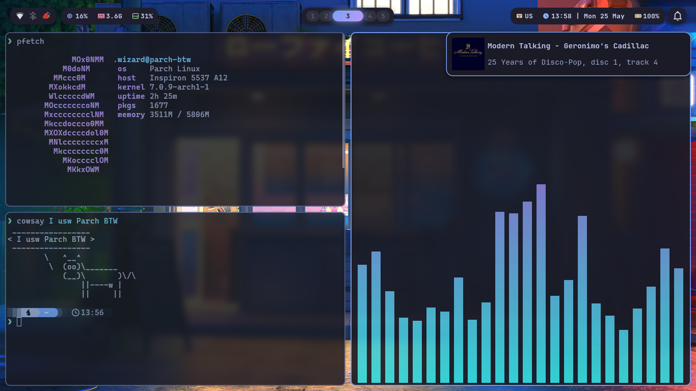

# My Arch Linux Dotfiles

Welcome to my personal Parch Linux (Arch Based) dotfiles repo!
A minimal, keyboard‑driven Hyprland configuration featuring the **Tokyo Night** color scheme.



I use [Parch Linux](https://parchlinux.com/en) (BTW)

Why [Parch Linux](https://wiki.parchlinux.com/en/Frequently_asked_questions#why-should-i-use-parch)

For wallpaper, I use this collection repo
https://github.com/tokyo-night/wallpapers

## ⚙️ Requirements

- Arch Linux (or Arch Based Distributions)
- Basic understanding of terminal and shell-script knowledge

## 📦 Packages Used

| Category             | Packages                               |
| -------------------- | -------------------------------------- |
| **Core**             | `hyprland`                             |
| **Bar / Launcher**   | `waybar`, `wofi`                       |
| **Notifications**    | `swaync`                               |
| **Wallpaper**        | `awww`                                 |
| **Authentication**   | `polkit-kde-agent`                     |
| **Portal**           | `xdg-desktop-portal` (Hyprland aware)  |
| **Logout**           | `wlogout`                              |
| **Screenshots**      | `hyprshot`                             |
| **Clipboard**        | `cliphist`, `wl-copy` (`wl-clipboard`) |
| **QT / GTK Theming** | `qt5ct`, `qt6ct`, `nwg-look`           |
| **Idle / Lock**      | `hypridle`, `hyprlock`                 |
| **Network**          | `network-manager-applet`               |
| **Bluetooth**        | `blueman`                              |
| **OSD**              | `swayosd`                              |
| **FileManager**      | `thunar`                               |


## 📂 Configuration Structure

All configs live in `~/.config/`:

```md
~/config
  ├── cava
  ├── fastfetch
  ├── fish
  ├── hypr
  │   ├── hypridle.conf
  │   ├── hyprland.lua
  │   ├── hyprlock
  │   │   ├── check-capslock.sh
  │   │   └── status.sh
  │   ├── hyprlock.conf
  │   └── modules
  │       ├── autostart.lua
  │       ├── binds.lua
  │       ├── decorations.lua
  │       ├── env.lua
  │       ├── input.lua
  │       ├── layout.lua
  │       ├── misc.lua
  │       ├── monitors.lua
  │       ├── permissions.lua
  │       └── windowrules.lua
  ├── kitty
  ├── swaync
  ├── swayosd
  ├── waybar
  ├── wlogout
  └── wofi
```
## 🚀 Installation

### 1. Install the required packages

**Arch / Arch Based Distros:**

```bash
paru -S hyprland xorg-xwayland xdg-desktop-portal-hyprland hyprland-qt-support awww wofi waybar polkit-kde-agent xdg-desktop-portal qt5ct qt6ct nwg-look hypridle hyprlock swaync hyprshot blueman swayosd network-manager-applet wlogout thunar light cliphist wl-clipboard hyprqt6engine qt6-wayland qt5-wayland ttf-jetbrains-mono-nerd
```

### 2. Clone or copy your dotfiles

```bash
git clone https://github.com/Parviz-sudo/dotfiles
cd dotfiles
cp -r .config/* ~/.config
cp -r TokyoNight.colors ~/.local/share/color-schemes
```

## 3. First launch

- Log out of your current session.
- From your display manager (or TTY) select **Hyprland**.
- If no DM, start with `Hyprland` from the TTY.


## 🎨 Theming Details

- **GTK / Qt:**
  - `nwg-look` → **Breeze** theme, dark variant.
  - `qt5ct` & `qt6ct` → **Breeze Dark** (apply once, then apps follow).
  - for qt apps choose TokyoNight from colorscheme.
- **Bar & Notifications:** Waybar and swaync styled with TokyoNight.
- **Wallpaper:** `awww` daemon runs at startup (set via `awww img /path/to/image`).

## ⌨️ Keybindings

| Action              | Shortcut                                    |
| ------------------- | ------------------------------------------- |
| **Terminal**        | `SUPER` + `Return`                          |
| **App launcher**    | `SUPER` + `R`                               |
| **Close window**    | `SUPER` + `Q`                               |
| **Toggle float**    | `SUPER` + `V`                               |
| **Screenshot**      | `PrtSc` (Fullscreen)                        |
| **Screenshot**      | `SUPER` + `PrtSc`                           |
| **Screenshot**      | `SUPER` + `SHIFT` + `PrtSc`                 |
| **Lock session**    | `SUPER` + `L`                               |
| **Logout menu**     | `SUPER` + `Esc`                             |
| **Volume up**       | `SUPER` + `F12`                             |
| **Volume down**     | `SUPER` + `F11`                             |
| **Mute**            | `AudioMute Button`                          |
| **Brightness up**   | `SUPER` + `F5`                              |
| **Brightness down** | `SUPER` + `F4`                              |
| **Custom bindings** | `SUPER` + `P`, `SUPER` + `J` (just dwindle) |

> 🔧 **Note:** Volume & brightness OSD is provided by `swayosd` – shows overlay on change.

## 🖼️ Usage Guide

### Wallpaper (awww)

- The daemon (`awww-daemon`) ensures wallpapers persist.

### Clipboard history (cliphist)

- View history: `SUPER + SHIFT + V`

### Notifications (swaync)

- Click on the waybar notification icon to open the notification center.
- Right‑click an entry to dismiss.

### Lock & Idle

- **Manual lock:** `SUPER + L` triggers `hyprlock`.
- **Automatic lock:** `hypridle` locks after 5 minutes of inactivity (adjust in `hypridle.conf`).

### Logout menu (wlogout)

- Press `SUPER + Esc` to show a grid with **logout**, **reboot**, **shutdown**, **suspend**, **lock** and **Hibernate**.

### Network (nm-applet)

- Look for the network icon in waybar’s tray (left side).
- Left‑click to open the connection menu, right‑click for advanced options.

### Volume / Brightness OSD

- Use the `SUPER` keys above – `swayosd` displays a smooth overlay.
- If OSD doesn’t appear, ensure `swayosd-server` is running (`ps aux | grep swayosd`).

## 🛠️ Troubleshooting

| Problem                                       | Likely fix                                                                                                                           |
| --------------------------------------------- | ------------------------------------------------------------------------------------------------------------------------------------ |
| **Screen sharing (Discord/Zoom) not working** | Install `xdg-desktop-portal-hyprland` and restart the portal: `killall xdg-desktop-portal; /usr/lib/xdg-desktop-portal -r`           |
| **Clipboard history not saving**              | Run `cliphist` manually: `wl-paste --watch cliphist store` – check it's in `exec-once`                                               |
| **GTK apps look wrong**                       | Open `nwg-look`, select **Breeze** and **Dark**, then click **Apply**. For Qt apps, open `qt5ct` / `qt6ct` and choose `Breeze Dark`. |
| **`awww` doesn’t set wallpaper**              | Make sure `awww-daemon` is running (`ps aux \| grep awww`). If missing, run `awww-daemon &` before `awww`.                           |
| **Waybar shows no icons**                     | Install a nerd‑fonts patched font (e.g., `ttf-nerd-fonts-symbols`) and set it in `waybar/style.css`.                                 |
| **Hypridle doesn’t lock**                     | Check that `hypridle` is running and that `hyprlock` is installed. Test with `hyprlock` manually.                                    |

# 📝 Customization Tips

- **Change keybindings** – Edit `~/.config/hypr/modules/binds.lua`.
- **Add your own wallpaper** – Use `awww img`.
- **Edit the logout menu** – Modify the layout in `~/.config/wlogout/` (`.css` and `layout` files).

---

**Enjoy your clean, TokyoNight Hyprland desktop!**
For further help, check the [Hyprland Wiki](https://wiki.hypr.land) or the individual tool documentation.
**If you like my configs, don't forget to leave a star ⭐**
**
